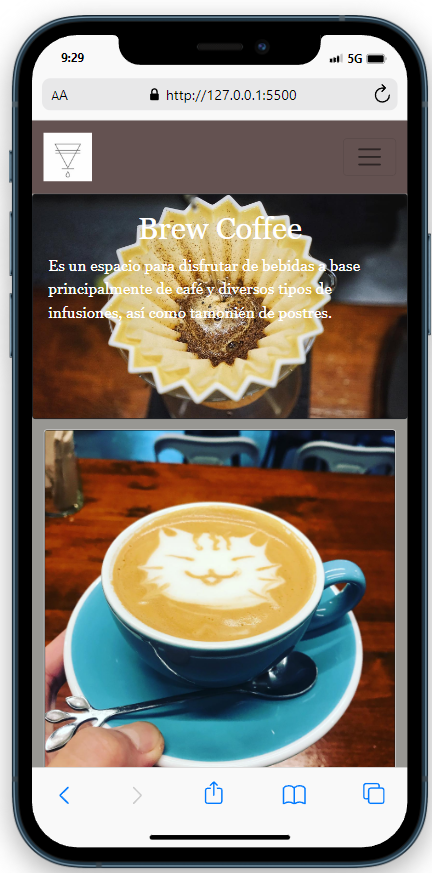
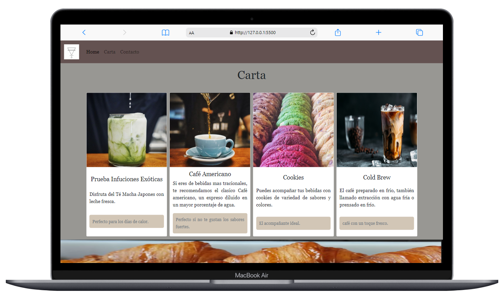

<h3 align="center">Project Menú</h3>

---

## 📝 Table of Contents

- [About](#about)
- [Getting Started](#getting_started)
- [preview](#preview)
- [Demo](https://cesarparada.github.io/Proyecto-Menu/)
- [Prerequisites](#prerequisites)
- [Built Using](#built_using)
- [Contact](#contact)
- [Acknowledgments](#acknowledgement)

## 🧐 About 

Realization of a web page project in which a restaurant menu is designed using HTML and Css, for this purpose bootstrap is used and responsible design parameters are applied

## 🏁 Getting Started 

for this, a code editor such as visisual estudio code is used, in HTML it must be linked with bootstrap for the designs and follow specific commands for its operation

## preview

### Prerequisites

Code editor.

## ⛏️ Built Using 

- [Bootstrap](https://getbootstrap.com/)
- [Visual Studio Code](https://code.visualstudio.com/)

## Contact

## 🎉 Acknowledgements 

- Professor. Fidel Gilart.
